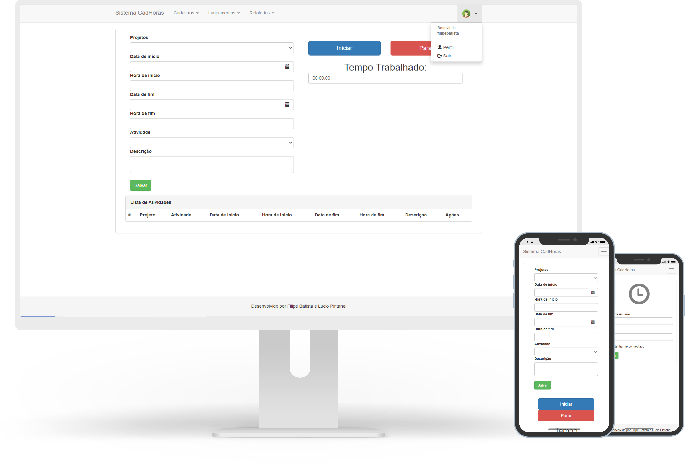

# Indice

- [Sobre](#-sobre)
- [Tecnologias](#Tecnologias)
- [Download](#Download)
- [Como baixar o projeto](#-como-baixar-o-projeto)

## 🔖&nbsp; Sobre

Sistema de controle de horas de tarefas realizadas.

---
## Tecnologias

Esse projeto foi desenvolvido com as seguintes tecnologias:

- [Python](https://www.python.org/)
- [Flask](https://flask.palletsprojects.com/en/1.1.x/)
- [Bootstrap 3.0](https://getbootstrap.com/docs/4.0/getting-started/introduction/)
- [sqlite3](https://flask.palletsprojects.com/en/1.1.x/patterns/sqlite3/)

Para mais veja o requirements.txt

---
## Download

<p>
    <a href="./.github/app.apk">
        
    </a>
</p>

---

## 🗂 Como baixar o projeto

```bash

    # Clonar o repositório
    $ git clone https://github.com/filipeleonelbatista/lpw-controlehoras-g2.git

    # Entrar no diretório desejado
    $ cd lpw-controlehoras-g2

    # Instalar as dependências
    $ pip install -r requirements.txt

    # Iniciar o projeto aberto na rede
    $ set FLASK_APP=manage.py
    $ flask run --host=0.0.0.0

    # Iniciar o projeto localmente
    $ python manage.py runserver
```

---

<p align="center">  
    Entre em contato comigo
    <br />
    <br />
    <a href="https://www.linkedin.com/in/filipelbatista/">
        
    </a>
    &ensp;
    <a href="mailto:filipe.x2016@gmail.com">
        
    </a>
    &ensp;
    <a href="https://instagram.com/filipegaucho22">
        
    </a>
    <br />
    <br />
    Desenvolvido 💜 por Filipe Batista  
</p>